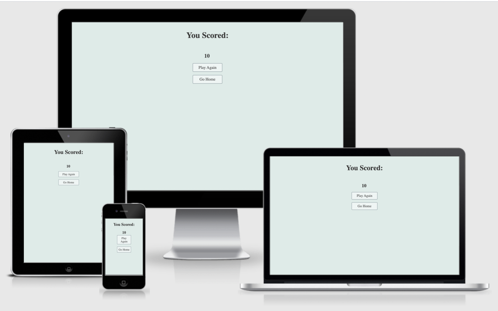
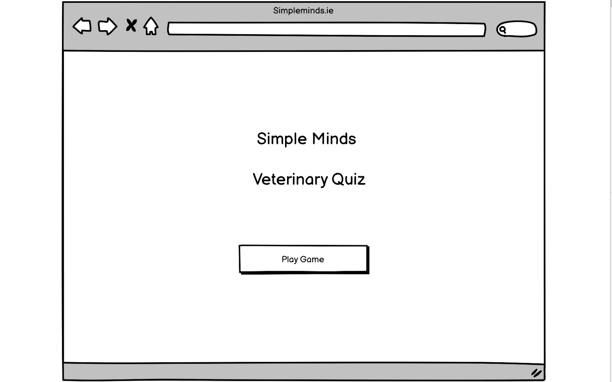
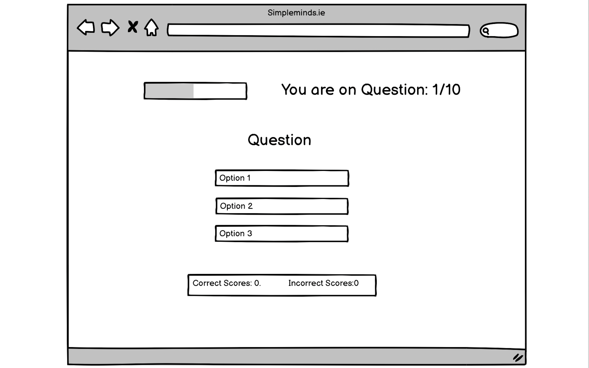

# Simple Minds Veterinary Quiz

## [View the live quiz here](https://marinamarshall.github.io/p2-js-quiz/)

## About the Quiz

Simple Minds is a three page quiz that begins on the home page. When the "play game" button is clicked, the user is taken to the game page. 

The quiz is a fun, interactive multiple choice questionaire that is designed for Veterinary and Veterinary Nursing students from years 1-5. The questions are a mixture of course content from all of the years and test the students' general knowledge on several different topics.

The design of the quiz ensures that the user can easily navigate the content and the interactive design keeps the user engaged while updating them on their current score and how many questions they have until the quiz is completed.

Once the quiz is finished, the user is informed of their score and they have a choice to either play another game or to return to the homepage.

## User Stories
* First Time Visitor Goals
 *   
 * 
 * 

* Returning Visitor Goals
 * 
 * 
 * 

## User Experience (UX)

### The Strategy Plane

Build an online quiz that is a fun game/challenge. The target audience is Veterinary and Veterinary Nursing students from years 1-5. It is a general knowledge quiz that assesses multiple modules from the college course.

### The Scope Plane

* It is a multiple choice quiz layout, the user must choose one option. The quiz will assess correct and incorrect answers and give the user this feedback.

* Potential future releases:
  * The addition of reasons behind the correct answer being correct. 
  * A timer feature so that the user has to manage their time like a real exam. 
  * The test could be broken down further into specific modules that the student could choose what to be tested on.

### The Structure Plane

This is a three-page quiz. 

* The homepage will display the button to be clicked to begin the quiz.

* This click will take the user to the game page that will display a question and options in MCQ style. There is an interactive display that counts the questions asked and the amount of correct and incorrect answers.
* Once the user has completed the game, they will be taken to the end page where they will be given their score and a choice to go back to the homepage or to play again.

### The Skeleton Plane

The page will have a straightforward layout so that the user will easily find what they are looking for. The user has one option to begin the quiz, taking questions randomly from a bank of questions. The question is displayed and the user is given three choices to answer from. Once the answer is selected, the answer is assessed for correctness/incorrectness.The quiz moves on to the next question until the maximum number of questions has been asked. The user can then choose if they want to play the quiz again or go back to the home page.

### The Surface Plane

## Colours
Neutral colours are chosen so that the user doesn't get distracted by background images and colours. The green colour for the background adds to the user experience without compromising their ability to see what is being asked of them. 

## Fonts/Typography
The font colour has been set to an off-grey/black colour so that it is less harsh to read. The font is set to Times, again so that it is clearly readable and the user can read everything easily.

## Technologies Used

### Languages used
* HTML5
* CSS3
* JavaScript ES6

### Frameworks, Libraries and Programmes used
* Google Developer Tools - Used during the coding process to identify errors in CSS and in JavaScript files

* Font Awesome - The flask icon was imported from FontAwesome to add style to the homepage font

* Favicon - The pawprint favicon adds some small but nice detail to the tab so the user can recognize the tab if they click off of it

* Github - Used to store the project code after being pushed from Git

* Git - Used for version control

* Gitpod - Used to edit code and using the terminal to add and commit code with key messages that were pushed to Github

* Balsamiq - Used to create wireframes for the quiz

* Hover.css: - Used on the link elements and option containers to add interactivity for the user

## Features

* Responsive on PC, laptop, tablet and phone screens

* Interactive elements:
  * "Play Game" Button
  * Options
  * Progress Bar
  * Question Counter
  * Score Area
  * Return Home/Play Again Buttons

## Credits
### Acknowledgements
* My mentor Chris for his support and motivation
* Tutor support, Sean at CodeInstitute for his help and feedback
* CodeInstitute course content
* Fellow peers on Slack
* Stackoverflow for general queries

### Content and Media

## Testing and Bugs
 * HTML was tested using [W3C Markup Validation Service](https://validator.w3.org/)

   * No errors detected.
   * Two warnings corrected where blank input was detected 

 * CSS was tested using [W3C CSS Validation Service](https://jigsaw.w3.org/css-validator/)

   * No errors or warnings detected

 * JavaScript was tested using [ES6 Syntax Check](https://www.piliapp.com/syntax-check/es6/)

   * Two errors resolved, missing semi-colon (x2)
   * No warnings detected

 ## Bugs Fixed
 ## Further Testing
### Screen Sizes
 * Desktop
 * Laptop
 * iPad
 * iPhone 6/7/8
 * iPhone 5/SE

 ###

## Deployment

1. Go to Github.com.
2. Select the repository to be deployed.
3. At the top of the repository on the right hand side, click the settings tab.
4. Scroll down to the "Github Pages" section and change the source branch to "master".
5. Click save.
6. Refresh the page.
7. Copy the live website link provided.
